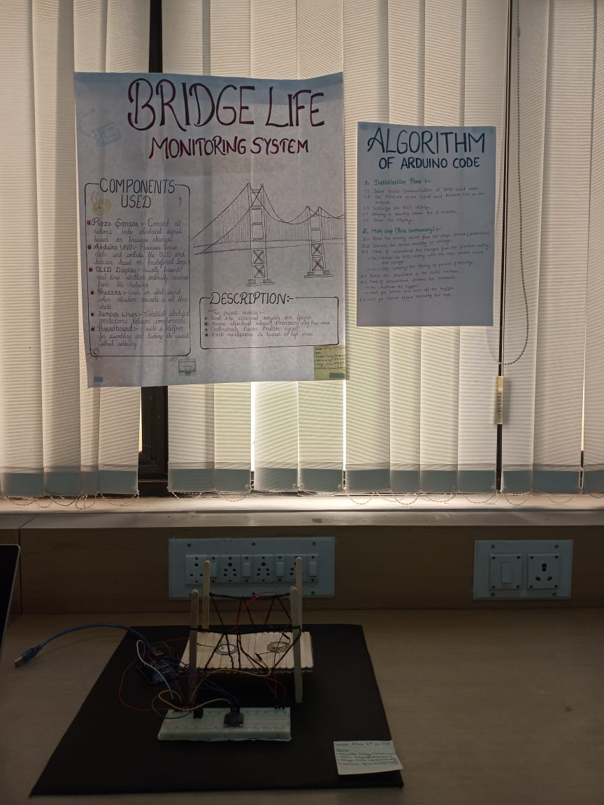
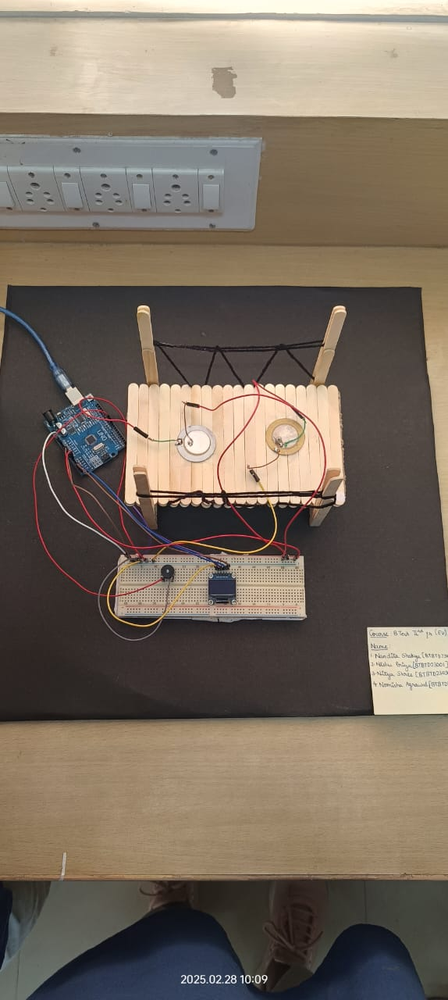

# Bridge Structural Health Monitoring System

## Overview
This project focuses on developing a **real-time system** to monitor the structural health and lifespan of bridges. By utilizing sensors such as vibration, stress, and load sensors (Piezo sensors), the system collects crucial data about the bridge's condition. Integrated with **IoT technology**, the system transmits data for early fault detection and predictive maintenance. Additionally, a data collection module is designed for periodic analysis and maintenance planning.

> **Status**: Ongoing

---

## Features
- **Real-Time Monitoring**: Tracks vibration, stress, and load data using Piezo sensors.
- **IoT Integration**: Transmits sensor data to a centralized system for analysis.
- **Fault Detection**: Enables early identification of potential structural issues.
- **Predictive Maintenance**: Provides insights for scheduling maintenance before critical failures occur.
- **Data Collection Module**: Stores data periodically for analysis and long-term planning.

---

## 📸 Project Demonstration

